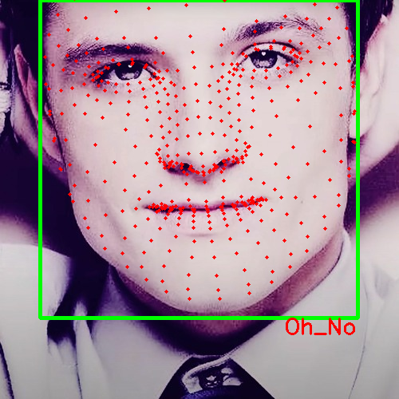

# Decent Facial Landmark Detection

This document provides a method for detecting facial landmarks using OpenCV and MediaPipe.

## How It Works

The provided code utilizes OpenCV to detect faces and MediaPipe to identify facial landmarks. Here’s a summary of the functionality:

1. **Face Detection**: Uses OpenCV’s Haar Cascade to identify faces in the image. It draws a green rectangle around detected faces and scales the rectangle size for better coverage.
2. **Facial Landmark Detection**: With MediaPipe's FaceMesh, it identifies facial keypoints if enabled. These keypoints are highlighted with red dots on the face.
3. **Text Annotation**: Displays the text "Face Detected" at the bottom-right corner of the bounding box around each detected face.
